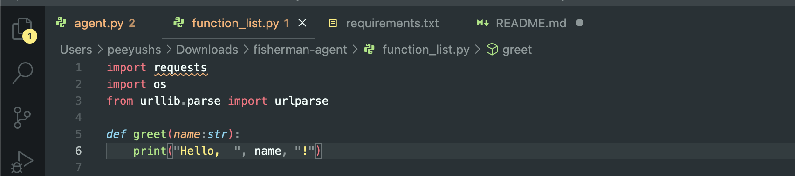
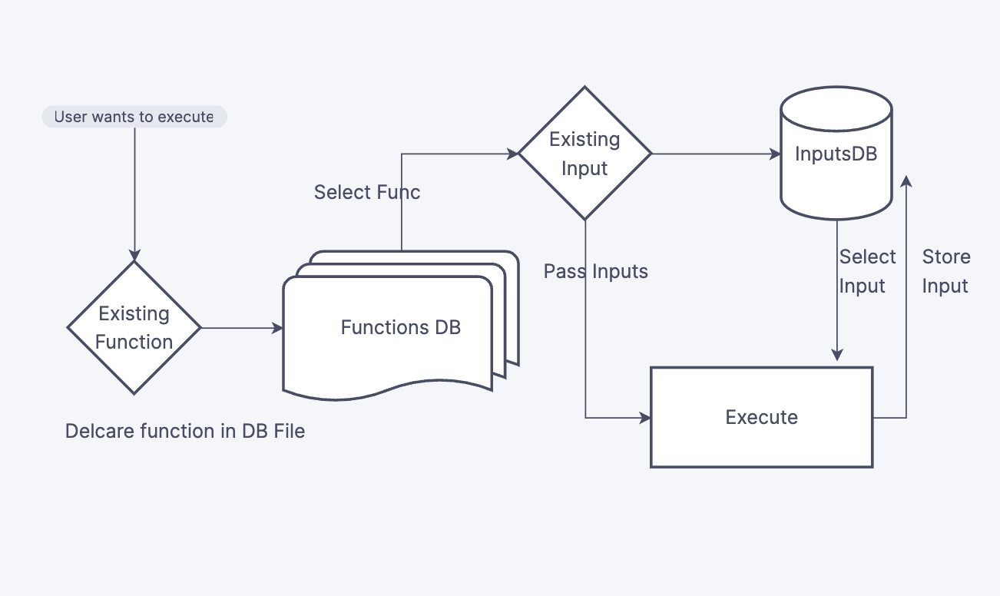

# fisherman-agent

"If you give a man a fish, you feed him for a day. If you teach a man to fish, you feed him for a lifetime." -  Anne Isabella 

Fisherman-agent is installed on a computer and has a set of pre-defined functions that it can perform, along with the inputs that are required for each function. The user can provide the inputs to the software and run the functions, and also has the option to save these inputs for future use, so that they don't have to enter them again next time they want to run the same function.

## Installation

Python3 must be installed. 

```
git clone https://github.com/peeyushsrj/fisherman-agent
cd fisherman-agent &&  pip3 install -r requirements.txt
```

## Usages 

```
python3 agent.py
```

Available flags 

- `--auto` disable verification prompts
- `--importdefinition url-for-csv` to sync local inputs file from cloud

```
python3 agent.py --importdefinition http://example.com/somecsvfile --auto
```

## Developer Flow

- Get the function definition from chatgpt or your own, put this into `functon_list.py`. 

- To run this function from command line. Run `python3 agent.py`, and select newly added `greet` function by typing and entering same keyword.  

- Since no input has been trained to `inputs.csv`, next step it will ask you to type "custom input". 
- This will print input parameters for the function, based on that enter the input. 
- If you wish to  save input, enter "y" to save it. So that next time this input will appear with "custom input". 
- Modify `inputs.csv` and modify value of column `skip` to command, so that this will attempted before running actual output. 

## Configurations

Manually create your functions and define them locally, in `function_list.py`. Recommeded, that function definition to be push once in a while to  `main` branch - for definition syncup. 

**Note** - Function delared must return something.  Something small function as just to print. 

```

def greet(name:str):
    str = "Hello,  "+ name + "!"
    return str 

```

**Note** - On how to make any excel sheet, as published to web as csv. Step 5-6
here https://www.algolia.com/doc/tools/crawler/guides/enriching-extraction-with-external-data/how-to/expose-google-spreadsheet-as-csv/

## Use cases

- Execute any commands on linux based system. 
- Collect function, reuse existing inputs.
- Run new inputs on function, save them for reuse. 
- Download function definition for global csv to update, along with repo for code.
- Suppose something can only be execute on certain condition, that condition in the form on bash or bat commands can be added to `inputs.csv` with `skip` field value.

## Architecture



## Contributing

Welcome for PR and issues. Feel free to fork and use! 

##  License

This project is licensed under the MIT License - see the [LICENSE](LICENSE) file for details.

## Upcoming Releases

- [ ] Selection of number instead of typing whole function_name
- [x] Import definition from external csv
- [ ] GPT3.5 API for direct function imports on demand
- [ ] Support for flow for clubbing together cmds

## Demo

<script async id="asciicast-GxZIvzbDGWpAShckhpQ0YwCJn" src="https://asciinema.org/a/GxZIvzbDGWpAShckhpQ0YwCJn.js"></script>
